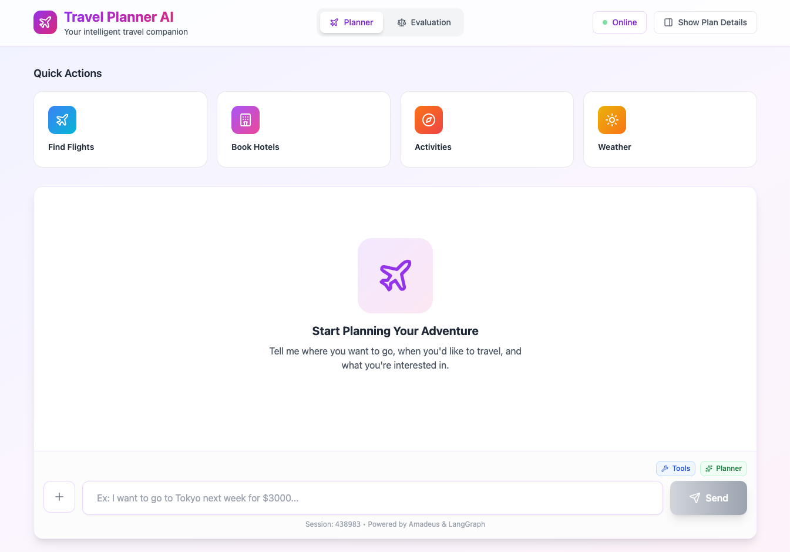
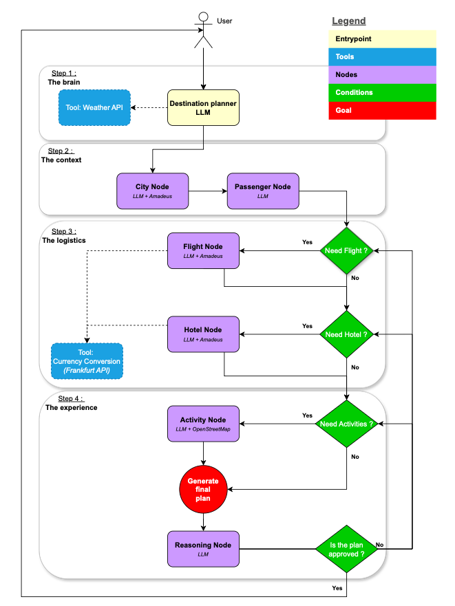

# Travel Planner



## Environment Variables (.env)

To use the Travel Planner, you need to set up your API keys in a .env file at the root of the project:

```bash
AMADEUS_API_KEY=your_amadeus_api_key
AMADEUS_SECRET_KEY=your_amadeus_secret_key
WEATHER_API_KEY=your_openweathermap_api_key
GEOAPIFY_API_KEY=your_geoapify_api_key
LANGCHAIN_API_KEY=your_langchain_api_key
LANGCHAIN_PROJECT="travel-planner"
# If you want to enable langsmith for monitoring
LANGSMITH_TRACING="true"
LANGSMITH_ENDPOINT="https://eu.api.smith.langchain.com"
```

You can also add the following environment variables if you want to specify a Hugging Face model:

```bash
MODEL_NAME="google/gemma-3-27b-it:nebius"
BASE_URL="https://router.huggingface.co/v1"
MODEL_PROVIDER="openai"
HF_TOKEN=your_huggingface_api_key
```

## API Key Sources

- Flight/Hotel/Activity APIs: Retrieve your key from [Amadeus for Developers](https://developers.amadeus.com/self-service/apis-docs/guides/developer-guides/quick-start)
- Weather API: Get your key from [OpenWeatherMap](https://openweathermap.org/api)
- Geo/Places API: Obtain your key from [Geoapify Places API](https://apidocs.geoapify.com/docs/places/)
- Hugging Face API : Obtain your key from [Hugging Face API](https://huggingface.co/docs/huggingface_hub/v0.14.1/en/guides/inference)

## Architecture

The project is composed of a React frontend and a FastAPI backend.

### Frontend

The frontend is a React application located in the `frontend` directory. It provides a user interface for interacting with the travel planning agent.


### Backend



The backend is a FastAPI application (`api.py`) that serves the frontend and exposes the travel planning agent. It uses a LangGraph-based agent to handle travel planning.

The agent is composed of several nodes, each responsible for a specific task in the travel planning process:

- **Planner Agent**: Creates the initial travel plan.
- **City Resolver**: Resolves the city and gets the city code.
- **Passenger Agent**: Gathers information about the passengers.
- **Flight Agent**: Searches for flights.
- **Hotel Agent**: Searches for hotels.
- **Activity Agent**: Searches for activities.
- **Compiler**: Compiles the final itinerary.
- **Reviewer**: Reviews the itinerary and provides feedback if the reasonning is enabled.

The agent's state is managed by `AgentState` and can be persisted using a checkpointer. The application uses a language model to power the agent, which can be configured using environment variables. The agent also uses several tools to gather information, such as Amadeus for flight, hotel, and activity search.

### Tools

The agent uses a variety of tools to access real-time information and perform specific tasks. These tools are located in the `src/tools` directory.

- **Date Tool**: Provides the current date.
- **Exchange Rate Tool**: Fetches currency exchange rates.
- **Location Tool**: Retrieves location-based information.
- **Weather Tool**: Gets the current weather for a given location.
- **Amadeus Tools**: A suite of tools for interacting with the Amadeus API, including:
  - `activity_search`: Searches for activities at the destination.
  - `city_search`: Finds city codes for flight and hotel searches.
  - `flight_search`: Searches for available flights.
  - `hotel_search`: Searches for hotels.

## Getting Started

### Running the Application

To start the application, follow these steps:

1.  **Start the Backend API:**
    Open a terminal in the project root directory and run:

    ```bash
    python api.py
    ```

2.  **Start the Frontend Development Server:**
    Open a _new_ terminal, navigate to the `frontend` directory, and run:
    ```bash
    npm run dev
    ```

### Running the Tests

To run the evaluation tests, open a terminal in the project root directory and execute:

```bash
python tests/test_agent.py [--use-planner] [--use-tools] [--use-reasoning]
```
